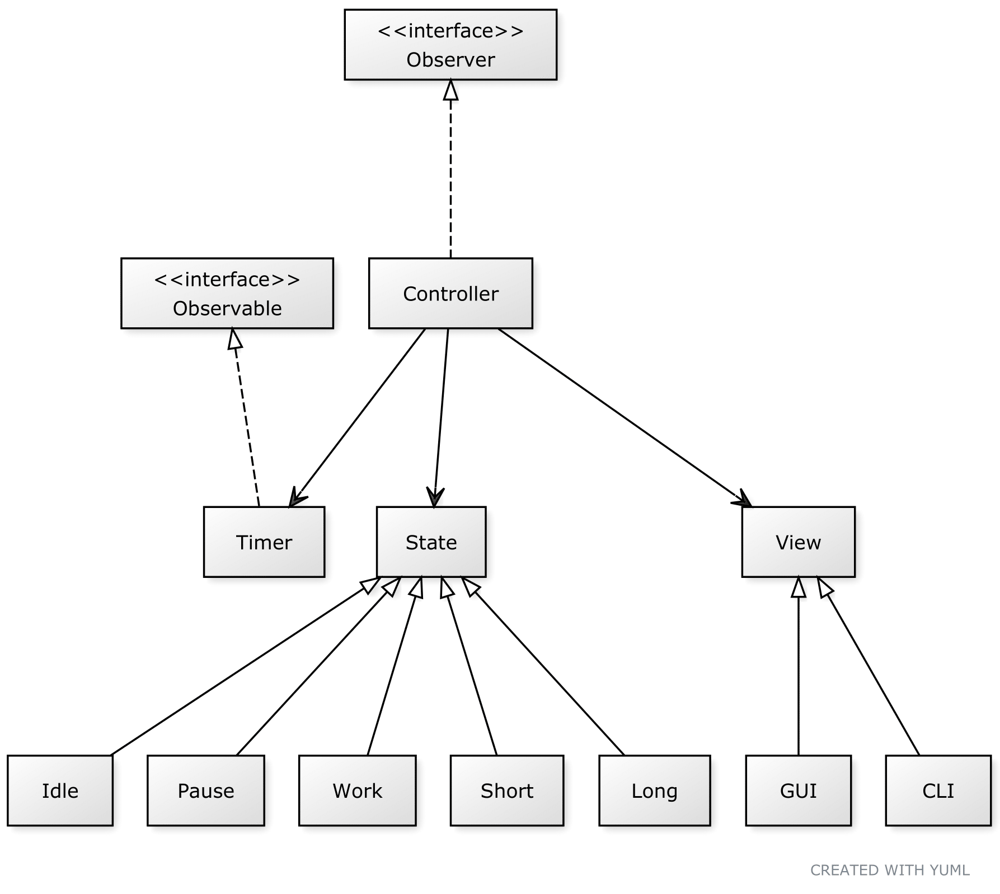
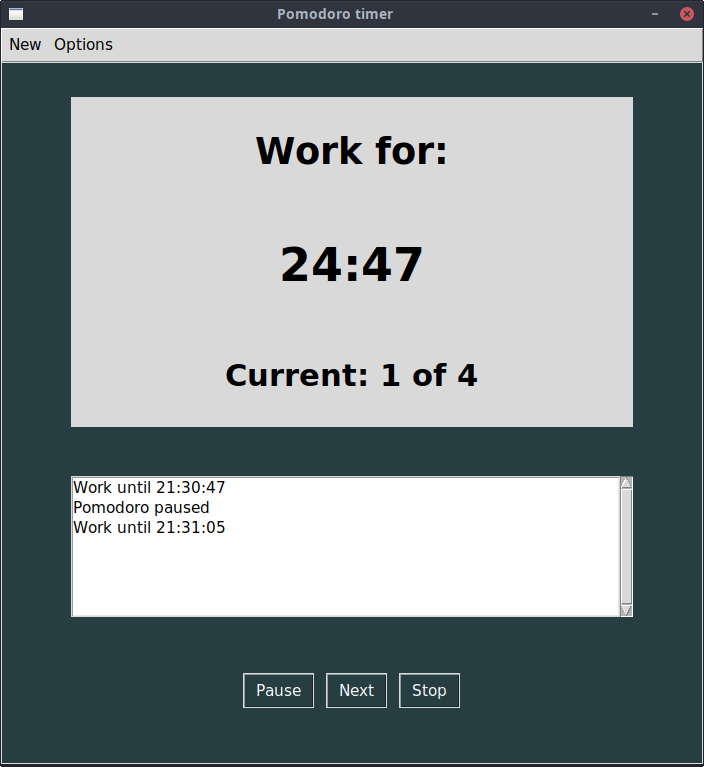
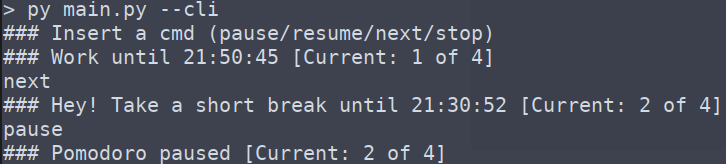

# pymodoro-timer
A simple pomodoro timer created with python.

## Table of contents
* [General info](#general-info)
* [UML Diagram](#uml-diagram)
* [Technologies](#technologies)
* [Setup](#setup)
* [Screenshots](#screenshots)

## General info
A side project focused on design pattern application and learning how to make GUI with python.  
Pymodoro-timer consists in a simple pomodoro timer (you don't say?).

## UML diagram

	
## Technologies
Project is created with:
* python 3.6
* tkinter

see `requirements.txt` for a list of used libraries generated with `pip3 freeze` command.
	
## Setup
To run this project via GUI:

```
$ pip3 install -r requirements.txt
$ python3 main.py
```

To run this project via CLI:

```
$ pip3 install -r requirements.txt
$ python3 main.py --cli
```

If you want to change the settings for the timer, do it via GUI or modify `.settings.json` file.

## Screenshots

